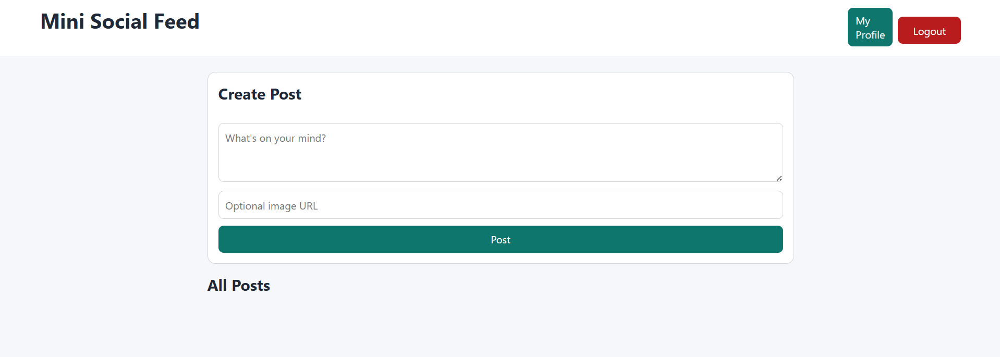
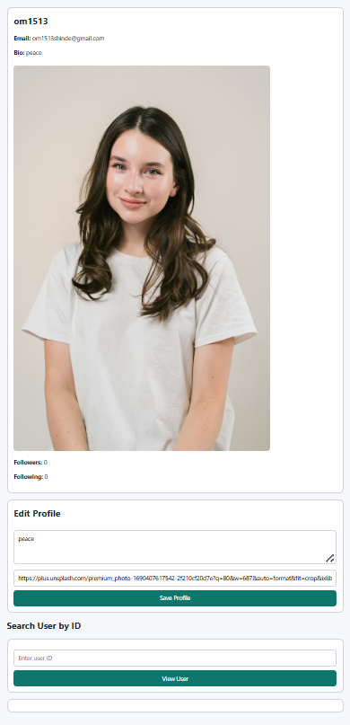
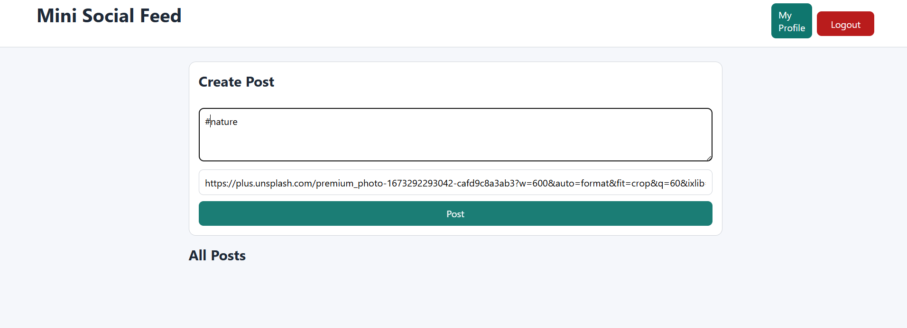
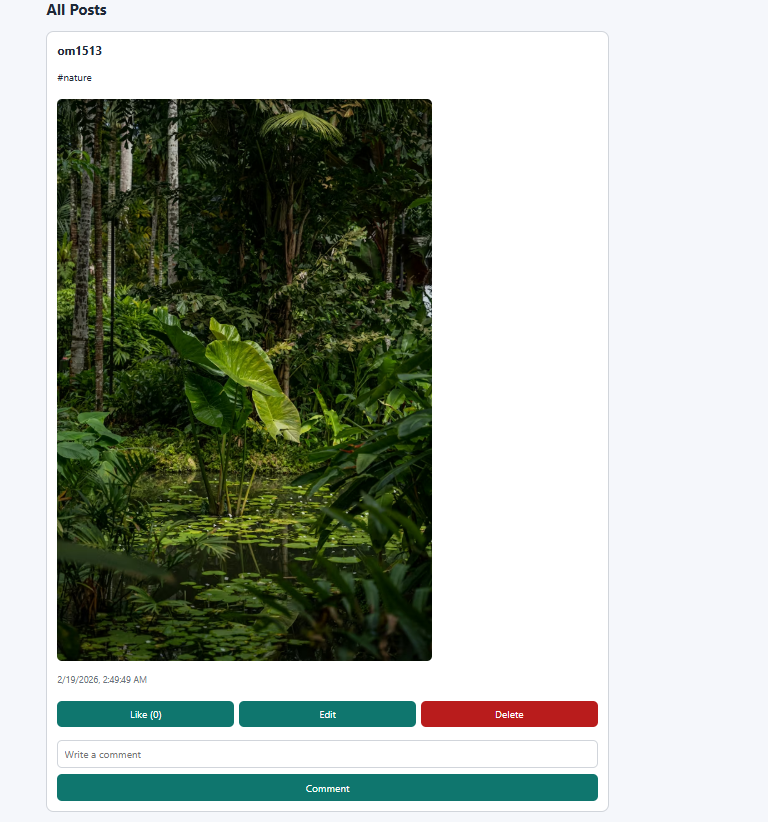

# Mini Social Media Platform

A full-stack mini social media application built using Node.js, Express, MongoDB Atlas, and Vanilla JavaScript.

This project includes core social networking features like authentication, posts, comments, likes, and follow/unfollow functionality.

---

## 🚀 Features

- User Registration & Login (JWT Authentication)
- Create, Edit & Delete Posts
- Like & Comment on Posts
- Follow / Unfollow Users
- User Profile with Bio & Profile Picture
- Protected REST APIs
- MongoDB Atlas Cloud Database

---

## 🛠 Tech Stack

Frontend: HTML, CSS, JavaScript  
Backend: Node.js, Express.js  
Database: MongoDB (Mongoose)  
Authentication: JWT & bcrypt

---

## 📸 Screenshots

---

## ⚙️ Run Locally

1. Clone the repository  
2. Run `npm install`  
3. Create `.env` file from `.env.example`  
4. Add your MongoDB Atlas connection string  
5. Run `npm run dev`  
6. Open `http://localhost:5000`

---

## 👨‍💻 Author

Developed by Om Shinde as part of an internship project.